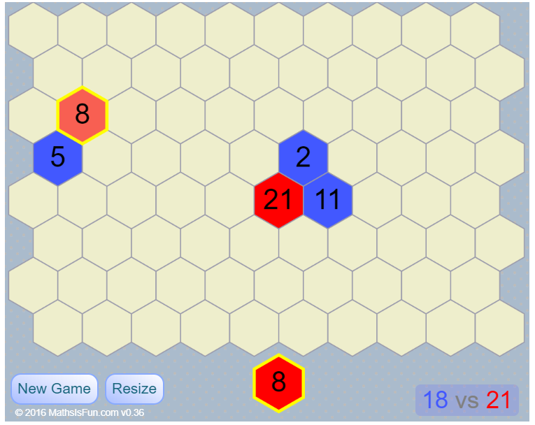

The objective of the game is to outscore the opponent by winning territories. A player's score is the sum of the values on their won territories. A player wins a territory by placing one of their tiles on an unclaimed territory. On placing a tile, adjacent friendly territories will have their value increased by one point. Adjacent enemy territories will be captured if they have a lower value than that of the newly placed tile. Captured territories change color to that of the capturing player. Players take turns placing tiles to capture territory. Players receive a tile of a random value between 1 and 20 on each turn. The game is finished when there are no more unclaimed territories.

Brian Cable https://github.com/bacable/ProximityBasic

Rod Pierce http://www.mathsisfun.com/games/proximity.html

